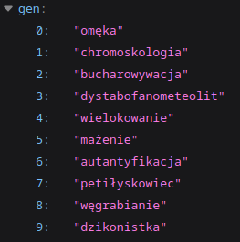
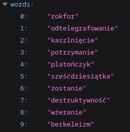

# Polish Word Generation

Polish word generation using Machine Learning

- bigarms
- MLP

## Generation

| Real words        | Generated words |
| ----------------- | --------------- |
| abiudykacja       | cyłogistyca     |
| arkadowanie       | chronon         |
| hebrajszczyzna    | ekompencja      |
| fotomontaż        | kormatyzracja   |
| jabłuszko         | żekonitielacha  |
| lampownia         | inwekratyczność |
| niesłuszność      | iziofilimowanie |
| płaskorzeźba      | preodomant      |
| stępor            | rzedawój        |
| wysiłek           | tap             |
| zewidencjonowanie | uzajni          |
| bezwładność       | zlerek          |
| grzybiarnia       | łóż             |
| wodowskaz         | oddzięcie       |
| ślusarnia         | rozproedzistka  |
| praworządność     | gruchesja       |

## API

| 10 random generated words                    | 10 random real words                           |
| -------------------------------------------- | ---------------------------------------------- |
| [mzums.com/pl/gen](https://mzums.com/pl/gen) | [mzums.com/pl/real](https://mzums.com/pl/real) |
|                                |                                |

## Dataset

training on ~48k words

dataset based on:  
https://raw.githubusercontent.com/ostr00000/jezyk-polski-slowniki/refs/heads/master/class_a.txt
